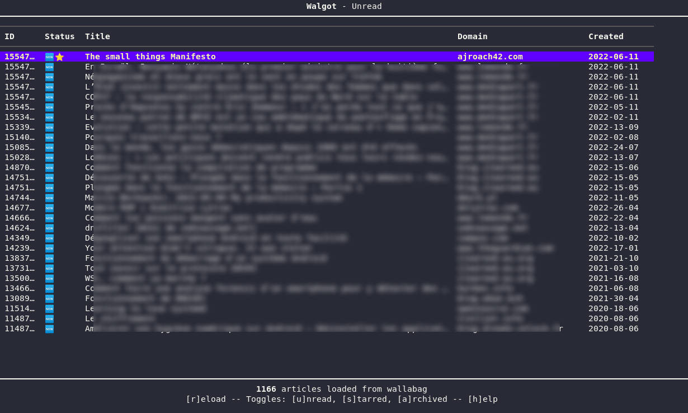
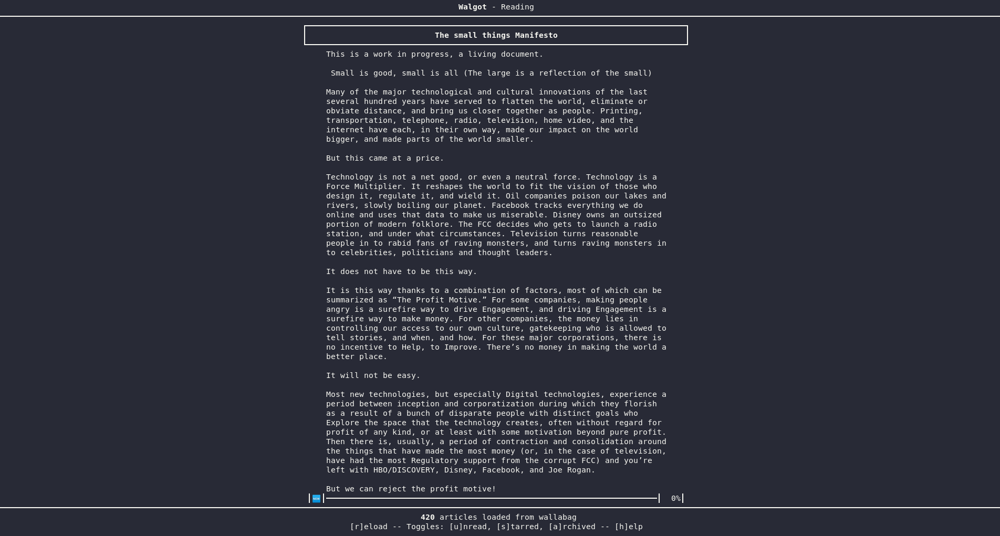

# Walgot - a WALlabag GO Tui client

Official repository and project is on [sourcehut](https://git.sr.ht/~bacardi55/walgot). Github and codeberg are only mirrors. This is where [binaries are uploaded](docs/install.md#via-binary-files).

## What is walgot?

Walgot is a TUI [wallabag](https://wallabag.org) client. Wallabag is an opensource "read it later" application that can be selfhosted. This application aims to be an easy and interactive TUI client for it.

Walgot is built in [golang](golang.org/), leveraging the great [bubbletea](https://github.com/charmbracelet/bubbletea) set of libraries and [Wallabago](https://github.com/Strubbl/wallabago), a wrapper to wallabag APIs.

Mandatory screenshots:

## Online only at this stage

**Important note**: The way walgot works is by downloading **all** articles from wallabag API at the start of the session (or when using the refresh keybind). Then walgot will allow filtering, viewing or updates (read, star) of articles and push changes via API. There is no local cache or database, so no offline usage (at least for now).

Once the initial load is done, internet access is not needed anymore to read articles content. It is needed for changing article status (like read or star). An offline mode might be added later, but there are more urgent features to build first :).

## Installation, configuration and usage

See the [installation and configuration documentation page](docs/install.md).

### Keybinds

At any time, press `?` key to display the help and `ctrl+c` to quit.

See the full list on the [keybind documentation page](docs/keybinds.md).

## Existing features and remaining TODOs:

High level available features at this stage:

- [x] Retrieve articles from wallabag
- [x] List articles view - columns depends on screen size.
- [x] Article detail view
- [x] Action on article
- [x] Status update (toggle read, starred and public status)
- [x] Configurable (see: )
- [x] Add Search (more a filter of article's title)
- [x] Add / Delete entry to wallabag
- [x] Open public/original article link
- [x] Yank/Copy public/original article URL

See the more detailed [todo documentation page](docs/todos.md).

## More Screenshots

See the [screenshots directory](docs/screenshots/index.md) directory.

## Help and feedback always welcome

Feedback or request? Send an email to the [dev mailing list](mailto:~bacardi55/walgot-devel@lists.sr.ht). You can also [read the mailing list archive](https://lists.sr.ht/~bacardi55/walgot-devel).

You can subscribe to the [announcement mailing list](https://lists.sr.ht/~bacardi55/walgot-announce).
